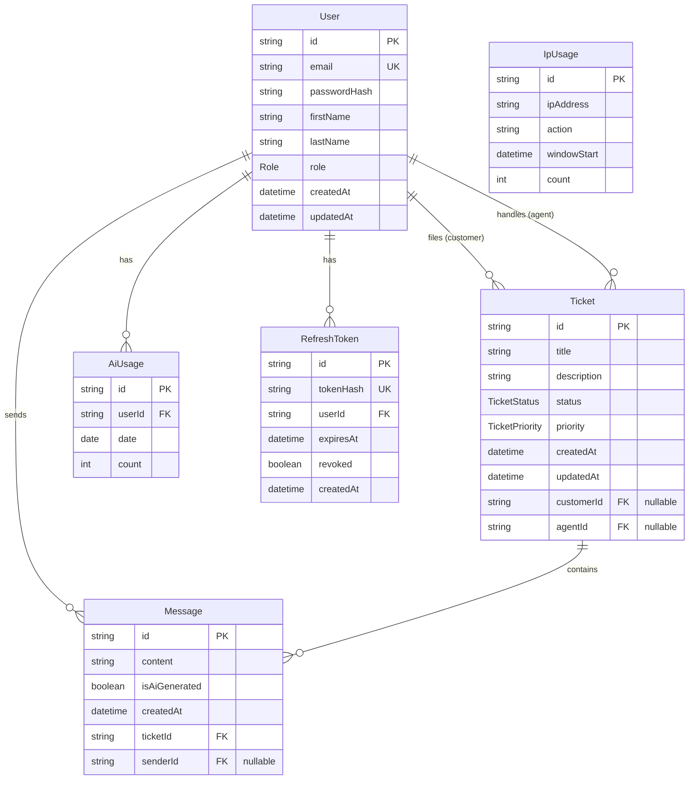

# Database Schema

This document describes the Prisma schema for the IT Helpdesk application: models, fields, enums, and how they relate to each other.

> Source of truth: `backend/prisma/schema.prisma`. Regenerate this doc manually if the schema changes.

## Overview

| Model | Purpose |
|---|---|
| `User` | Customers, agents, and admins |
| `Ticket` | A support ticket filed by a customer, optionally assigned to an agent |
| `Message` | A message thread entry on a ticket (human or AI-generated) |
| `AiUsage` | Per-user, per-day counter for AI chat rate limiting |
| `IpUsage` | Per-IP, per-action, per-time-window counter for rate limiting (e.g. login attempts) |
| `RefreshToken` | Hashed refresh tokens issued to a user for session renewal |

## Entity-Relationship Diagram

## Enums

### `Role`
| Value | Description |
|---|---|
| `CUSTOMER` | Default role; can create and view own tickets |
| `AGENT` | Can view and manage the ticket queue |
| `ADMIN` | Full access |

### `TicketStatus`
| Value | Description |
|---|---|
| `OPEN` | Newly created, unresolved |
| `IN_PROGRESS` | Being worked on by an agent |
| `RESOLVED` | Fixed, pending customer confirmation |
| `CLOSED` | Finalized |

### `TicketPriority`
| Value | Description |
|---|---|
| `LOW` | |
| `MEDIUM` | Default |
| `HIGH` | |
| `URGENT` | |

## Models and Relations

### `User`
Central identity model. A user's `role` determines what they can do; a single `User` row can act as both a ticket-filer and, if their role permits, an agent on other tickets.

- `ticketsAsCustomer` — tickets this user filed (`Ticket.customer`, relation name `CustomerTickets`)
- `ticketsAsAgent` — tickets this user is assigned to (`Ticket.agent`, relation name `AgentTickets`)
- `messages` — all messages this user has sent, across any ticket
- `aiUsages` — daily AI-chat usage counters, for rate limiting
- `refreshTokens` — active/expired refresh tokens issued to this user

Two named relations (`CustomerTickets`, `AgentTickets`) exist because `Ticket` has two separate foreign keys pointing back to `User` (customer and agent), so Prisma needs the relation name to disambiguate which is which.

### `Ticket`
The core support request. Filed by a customer; may or may not have an agent assigned yet. Both `customer` and `agent` are nullable — a ticket survives account deletion of either party (see GDPR note below), it just loses the association.

- `customer` (nullable) — the `User` who filed the ticket, via `customerId`; `null` if that customer's account was later deleted
- `agent` (nullable) — the `User` currently assigned, via `agentId`; `null` means unassigned, or the assigned agent's account was deleted
- `messages` — the full conversation thread on this ticket

### `Message`
A single entry in a ticket's conversation. Can come from a customer, an agent, or be AI-generated (`isAiGenerated: true`) when the AI chat path (Step 5 of the build plan) creates or replies to a ticket on the user's behalf. `sender` is nullable so a message survives its author's account deletion; the deletion flow replaces `content` with a placeholder like `"[deleted user]"` before nulling `senderId`.

- `ticket` — the parent ticket, via `ticketId` (`onDelete: Cascade` — deleting a ticket deletes its messages)
- `sender` (nullable) — the `User` who sent it, via `senderId`

### `AiUsage`
Tracks how many AI chat requests a user has made on a given calendar day, backing the "10 AI requests/day" rate limit. `@@unique([userId, date])` ensures one row per user per day; `count` is incremented on each request.

### `IpUsage`
Tracks rate-limited actions by IP address rather than by user — used for things like login-attempt throttling (5 attempts / 15 min) where the actor may not be authenticated yet. `@@unique([ipAddress, action, windowStart])` scopes the counter to a specific action type and time window.

### `RefreshToken`
Issued on login/refresh to allow session renewal without re-authenticating. Only the **hash** of the token is stored (`tokenHash`), never the raw token. `revoked` allows explicit invalidation (e.g. on logout, password change, or email change) before `expiresAt` naturally elapses. `onDelete: Cascade` on the `user` relation — deleting an account hard-deletes its refresh tokens, since they're pure session data with no anonymization concern.

## GDPR / account deletion behavior

Deleting a `User` does not cascade-delete their tickets or messages — it anonymizes instead:
1. That user's `Message.content` rows are replaced with a placeholder before deletion.
2. The `User` row is deleted. `Ticket.customerId`/`agentId` and `Message.senderId` are set to `null` via `onDelete: SetNull`, preserving ticket/message history for the other party (e.g. an agent's resolution record survives a customer deleting their account).
3. `RefreshToken` rows for that user are hard-deleted via `onDelete: Cascade` — no anonymization concern, they're pure session data.

## Notes

- All primary keys use `cuid()`.
- Timestamps: `createdAt` defaults to `now()`; `updatedAt` auto-updates on write via `@updatedAt`.
- Prisma v7: the datasource URL lives in `prisma.config.ts`, not in `schema.prisma`. `PrismaClient` requires a driver adapter (`@prisma/adapter-pg`) at instantiation.